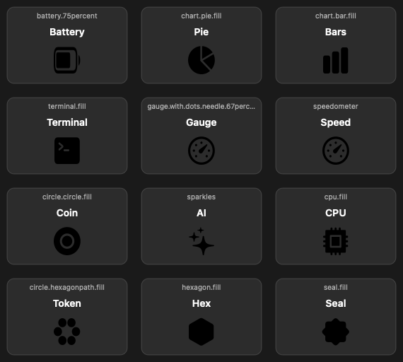

# Codex Usage Menu

A tiny macOS menu bar meter for watching Codex usage.

It reads Codex remaining usage from the ChatGPT-backed Codex usage endpoint, using the existing local Codex login in `~/.codex/auth.json`. The menu bar shows both remaining windows with their reset timers, like `59% (3h) 79% (5d)`, and the dropdown includes local Codex token activity from `~/.codex/state_5.sqlite`.



## Notes

- This does not send prompts or start Codex turns. Refreshing should not consume model tokens.
- It polls every five minutes.
- It reads your local Codex auth token but never displays or logs it.
- While running, it sends that token as an `Authorization: Bearer ...` header to `https://chatgpt.com/backend-api/codex/usage`.
- The usage endpoint is not a public stable API, so future Codex/ChatGPT changes may require an update.
- If your local Codex login expires, refreshes can fail until you log back in with Codex.

## Requirements

- macOS 13 or newer.
- Apple Silicon Mac by default (`build.sh` targets `arm64-apple-macos13.0`).
- Xcode Command Line Tools with `swiftc`.
- An existing Codex login in `~/.codex/auth.json`.

## Build

```sh
./build.sh
```

The app bundle is created at:

```text
build/Codex Usage.app
```

## Run

Open the app bundle from Finder, or run:

```sh
open "build/Codex Usage.app"
```

## Optional Launch At Login

Use the checkmarkable `Launch at Login` item in the app dropdown.

The shell helpers below do the same thing manually:

```sh
./install-login-item.sh
```

To remove the login item:

```sh
./uninstall-login-item.sh
```

The meter refreshes every five minutes. Click it to refresh, open the Codex usage page, toggle launch-at-login, or quit.

The menu bar displays the short and weekly Codex usage windows side by side.

If you move the app after enabling launch-at-login, toggle `Launch at Login` off and on again so macOS points to the new app path.
